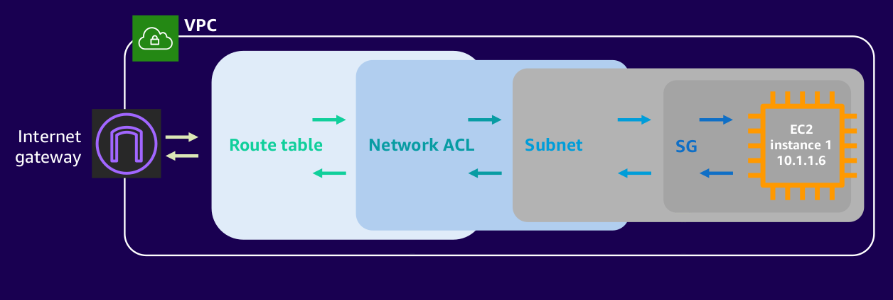
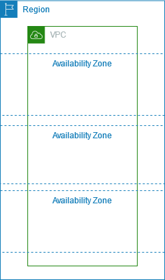

# VPC - virtual private cloud

vpc live in region and different from region to region, vpc to vpc

vpc is above availability zones

which mean every availability zone in one region can use the same vpc

vpc define an CIDR block

Examples: `10.0.0.0/16`

# Subnets

Subnets is under vpc

Subnets is an ip range of vpc

Examples: vpc is: `10.0.0.0/16`, then subnet can be:

- `10.0.1.0/24`
- `10.0.2.0/24`
- ...

Subnets can live in different availability zones but instances in these subnets can connect to each other using private ip addresses

As examples above. Let's say there are two instances:

- `instance-1` has ip `10.0.1.11` in subnet `10.0.1.0/24`
- `instance-2` has ip `10.0.2.12` in subnet `10.0.2.0/24`

can connect to each other (of couse security group **must** be set to **allow** it)

## args

- `map_public_ip_on_launch` = `true` | `false`
  - this option will assign public ip address to instance that live in this subnet
  - default is false so when created instance will **not** have public ip address

# Internet Gateway

It's needed for instance to connect outside Internet, and outside internet can connect to instance

# Route Table

lie between vpc and subnet, act like a router (of course)
